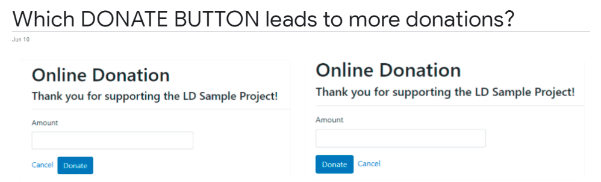
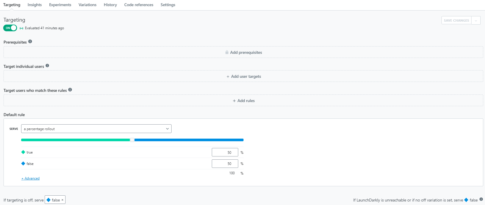
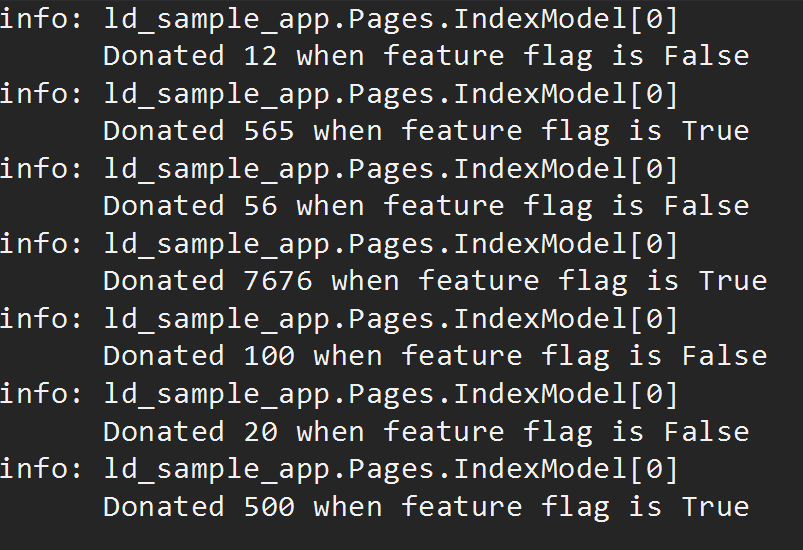

# LaunchDarkly Sample Application - ACTION BUTTON PLACEMENT EXPERIMENT

In this sample Online Donation web application, we demonstrate the use of feature flags to run a user-experience experiment.

__DO PEOPLE CLICK MORE (DONATE MORE) WHEN THE "DONATE" BUTTON IS PLACED ON THE RIGHT OR THE LEFT?__



The experiment works as follows.

## How It Works

1. Edit `appsettings.json` and set the value of `LdSdkKey` to your LaunchDarkly SDK key.

2. In your LaunchDarkly project and environment, create a feature flag called `donate-button-on-right`.



3. Run the application in Visual Studio or from the command line:

```
    dotnet run --project ld-sample-app
```

The Online Donation page will load and display the action button `DONATE` either on the right or left based on the evaluated flag.  Since the targeting rule is a percentage rollout (50% on the right and 50% on the left), you can perform the experiment by refreshing the page and clicking the `DONATE` button.

The experiment's data points (evaluated flag value + click action) are logged to the Output console (optionally to a database) to analyze the effectiveness of the action button placement.



## Important Notes

1. To record a data point for the experiment, we first retrieve the random flag value in the GET action and store its value in `TempData["FF_DONATE_BUTTON_ON_RIGHT"]`.  The evaluated flag is used to display the `DONATE` button (right or left).

```csharp
    [TempData]        
    public bool FF_DONATE_BUTTON_ON_RIGHT { get; set; }

    User user = LaunchDarkly.Sdk.User.Builder(Guid.NewGuid().ToString())
        .Anonymous(true)
        .Build();
    FF_DONATE_BUTTON_ON_RIGHT = _ldClient.BoolVariation(FF_DONATE_BUTTON_ON_RIGHT_KEY, user, false);


    // HTML code (Razor page)
    @if (Model.FF_DONATE_BUTTON_ON_RIGHT)
    {
        <div class="form-group">
            <a asp-page="Index">Cancel</a>&nbsp;
            <input type="submit" value="Donate" class="btn btn-primary" />
        </div>
    }
    else
    {
        <div class="form-group">
            <input type="submit" value="Donate" class="btn btn-primary" />&nbsp;
            <a asp-page="Index">Cancel</a>
        </div>
    }
```

We then pass the evaluated flag value to the POST action to record the click action.  This combination of evaluated flag and click action constitutes a data point for the experiment. 

```csharp
    // Submit donation and log experiment
    _logger.LogInformation("Donated {donation-ammount} when feature flag is {flag-value}", Donation.Amount, FF_DONATE_BUTTON_ON_RIGHT);
```

2. The `LdClient` SDK client should only be created once and shared across all the services and requests.  We do this by adding a singleton service in `Startup.cs` and injecting it into the PageModel.

```csharp
    services.AddSingleton<ILdClient>(new LdClient(Configuration["LdSdkKey"]));
```
